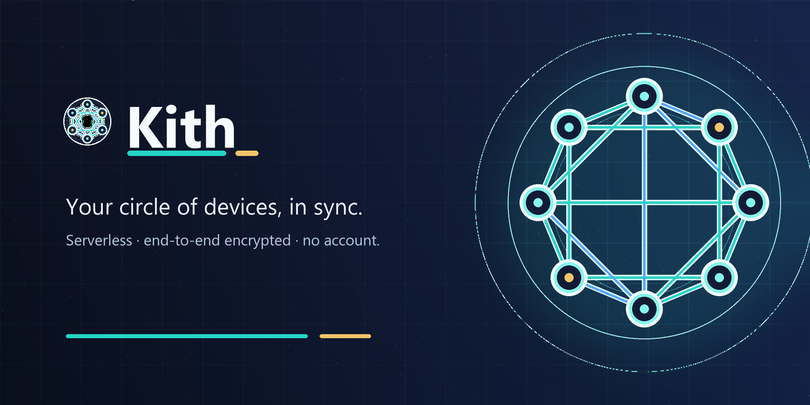

<p align="center">
  
</p>

<p align="center">
  <a href="https://github.com/muhamadjawdatsalemalakoum/kith/actions/workflows/ci.yml"></a>
  <a href="https://github.com/muhamadjawdatsalemalakoum/kith/releases"></a>
  
  
</p>

> *kith* — one's own trusted circle. **Kith keeps your circle of devices in sync.**

Kith is a **serverless, end-to-end-encrypted, no-account** desktop app for keeping your
own devices in sync — your **memory/notes**, your **saved tabs**, and your **files** —
directly device to device, with **no server that can read them, because there isn't one.**
Linking a device is a short pairing code, not an account. And because it speaks **MCP**,
your AI assistant can read and add to the very same data.

Built on [iroh] (QUIC transport, mainline-DHT discovery) and [Automerge] (CRDTs).

## What you get

A single desktop app (Windows · macOS · Linux) with:

- **🧠 Memory** — notes and facts that sync across every linked device.
- **🔖 Tabs** — save links/pages and have them everywhere.
- **📁 Files** — send files straight to your own devices: end-to-end encrypted, no size
  limit, no cloud, with live progress and a direct-vs-relayed badge.
- **🔗 Devices** — link another computer with a one-time code (SPAKE2). No account.
- **🤖 Agents** — point Claude Desktop / Cursor at Kith over MCP; your AI can use your
  memory, tabs, and files locally.

## Install

**Download** a build for your OS from the [Releases page](https://github.com/muhamadjawdatsalemalakoum/kith/releases)
(Windows `.exe`, macOS `.dmg`, Linux `.AppImage`/`.deb`/`.rpm`). Builds are currently
unsigned (alpha), so your OS may warn about an unverified developer — on Windows choose
*More info → Run anyway*; on macOS use *System Settings → Privacy & Security → Open Anyway*.

**Or build from source** (needs the [Rust toolchain](https://rustup.rs) + the
[Tauri prerequisites](https://v2.tauri.app/start/prerequisites/) for your OS):

```sh
cargo run -p kith            # build + launch the desktop app
cargo tauri build            # build installers (needs: cargo install tauri-cli)
```

## Connect your AI (MCP)

The same `kith` binary doubles as a local MCP server. In the app, open **Agents** to copy
a ready-made config, or add this to your MCP client (e.g. Claude Desktop's
`claude_desktop_config.json`) and restart it:

```json
{ "mcpServers": { "kith": { "command": "/path/to/kith", "args": ["serve"] } } }
```

Your agent then gets `memory.*`, `tabs.*`, and `files.*` tools — operating on the **same**
encrypted replica the app uses, entirely on your machine. With the Kith app open,
`kith serve` automatically bridges to it (one shared engine); with the app closed, it
runs standalone.

## How it works

- **Flat mesh, no hub.** Every device is an equal peer holding a full encrypted replica.
  Changes propagate directly between your devices over [iroh] QUIC (TLS 1.3).
- **CRDT state + gated blobs.** Mutable state is an [Automerge] document (conflict-free,
  offline-tolerant); files ride content-addressed, BLAKE3-verified blob transfer. **Both
  sync and file transfer are gated by a mutual group-key handshake** — a non-member is
  refused before any byte is exchanged.
- **No account.** Devices link with a short pairing code (SPAKE2-derived group key);
  pairing is mutual, so both sides learn each other and converge.
- **Honest serverless.** "No server that can read your data" — not zero-infra: discovery
  is the public DHT and a relay is used only as a fallback (and it only ever forwards
  ciphertext). If all your devices are off, updates are *pending, not lost*.

See [docs/PAIRING.md](docs/PAIRING.md) for the link flow and [docs/PRIVACY.md](docs/PRIVACY.md)
for exactly what is and isn't stored.

## Repository layout

```
mesh-engine/    the substrate: identity, mainline-DHT discovery, relay fallback,
                SPAKE2 pairing, group-key-gated CRDT sync + blob transfer, at-rest
                encryption. The ONLY crate that touches iroh / automerge.
mesh-mcp/       a tiny MCP host — implement one trait and an app's data + actions
                become readable/writable by any AI agent, with no server in the loop.
apps/memory/    agent-memory: portable, vendor-neutral memory (the memory schema).
apps/tabs/      centraltabs: cross-device tab/link sync.
apps/files/     kith-files: file sharing on the blob primitive.
apps/desktop/   ★ kith: the Tauri desktop app (GUI) + `kith serve` unified MCP server
                that runs all three apps on one shared engine.
```

The engine is the product; the apps are thin and share one `Mesh` (one identity, one
pairing, one replica). See [ROADMAP.md](ROADMAP.md) for invariants and what's next.

## Security status — alpha (locally tested; not independently audited)

Enforced today, each with tests:

- ✅ **Transport** is end-to-end encrypted (iroh QUIC / TLS 1.3).
- ✅ **Access control on sync AND files** — only peers proving the shared group key
  (mutual HMAC) may sync state *or* fetch blobs; a non-member is rejected before any data
  flows. Tests: `wrong_group_key_cannot_sync`, `stranger_cannot_fetch_blob`.
- ✅ **Account-free, mutual pairing** — a device joins from a short code via SPAKE2 (a
  wrong code hands out nothing), and the host learns the joiner so both sides converge.
- ✅ **Encrypted at rest** — the replica is XChaCha20-Poly1305 encrypted on disk.

Honest caveats (the path from alpha to "trust it broadly"):

- The at-rest key currently lives in a `0600` file in the data dir (no permission
  hardening on Windows yet) — moving it into the OS keychain / a passphrase is planned.
- The crypto has **not** had an independent audit (and `spake2 0.4` is itself unaudited).
- Removing a device today stops syncing with it locally, but does not yet rotate the
  group key (no forward secrecy). Group re-key on leave is planned.
- Real-NAT hole-punching and live-DHT/relay behavior are verified by hand, not in CI.

See [SECURITY.md](SECURITY.md) to report an issue.

## License

Dual-licensed under [MIT](LICENSE-MIT) **or** [Apache-2.0](LICENSE-APACHE), at your option.

[iroh]: https://iroh.computer
[Automerge]: https://automerge.org
